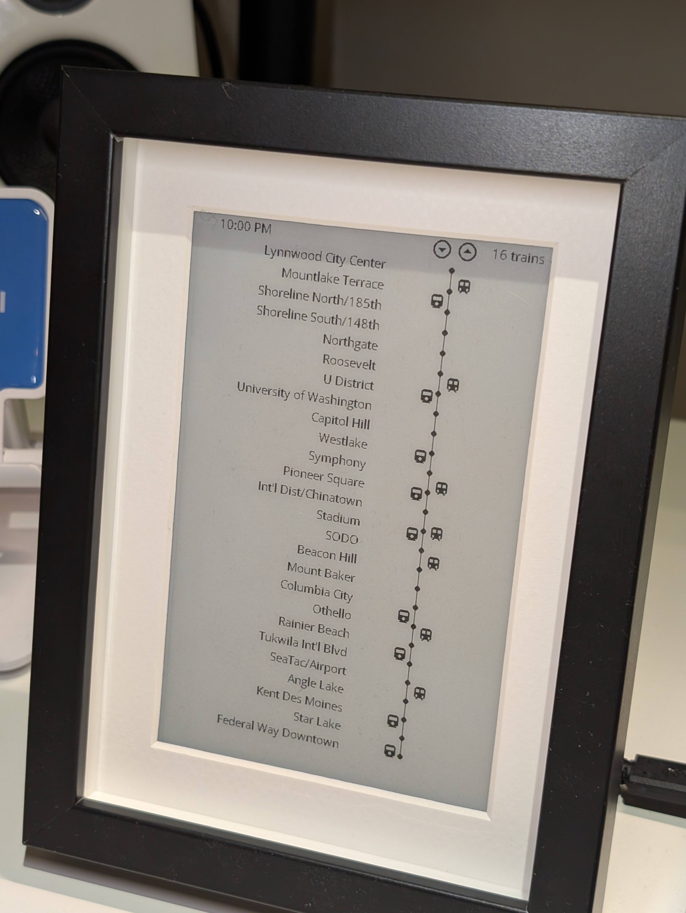

# ESP32 E-Ink Weather Dashboard

This project is an ESP32-based weather dashboard that displays information on a 7.5-inch e-ink display. It is based on [esphome-weatherman-dashboard](https://github.com/Madelena/esphome-weatherman-dashboard) by Madelena.

## Project Journey

This project began as a weather dashboard, pulling data from Home Assistant to create a daily "at-a-glance" weather display.  This is V1.  

At some point, I decided it should become a real-time transit display for Seattle's Link light rail.  This is V2.  

During this shift, I realized a couple issues from V1:  

*   **Incorrect Display Model**: The initial configuration was wrong and needed to be `7.50inV2alt`.  The screen was frequently grey and got worse over time.  
*   **Inverted BUSY Pin**: The BUSY pin on this particular display is inverted. The ESPHome configuration required `inverted: true` for the `busy_pin` to ensure the ESP32 could correctly read the display's status.

The other fun part: The ESP32 does not have enough memory to handle the API output.  I initially tried to have the ESP32 directly pull the data, but that overflowed every time.  So, we use Home Assistant to parse the output from the API.  

V2:



V1:


## Hardware

This project uses the following hardware:
- ESP32 Board - [Amazon Link](https://www.amazon.com/dp/B07M5CNP3B)
- Waveshare 7.5inch E-Ink Display V2 (800×480 Resolution, SPI Interface) - [Amazon Link](https://www.amazon.com/dp/B075R4QY3L) 

## Prerequisites

### Setup ESPHome

Before you begin, you need to install ESPHome:

- Install ESPHome following the [official documentation](https://esphome.io/guides/installing_esphome.html)
- Home Assistant users can simply install the ESPHome add-on from the Add-on Store

## Setup and Configuration

### Initial Setup

1. Create a `secrets.yaml` file in the same directory as `eink.yaml`
2. Add your WiFi credentials to the `secrets.yaml` file:

```yaml
wifi_ssid: [YOUR_WIFI_SSID]
wifi_password: [YOUR_WIFI_PASSWORD]
```

### Updating and Flashing

To update and flash the configuration to your ESP32:

```bash
esphome run eink.yaml
```

### Wiring Instructions

Connect the ESP32 to the Waveshare E-Ink display using the following pin configuration. 

**Note**: The `BUSY` pin for this display is inverted. See the `eink.yaml` for the correct configuration (`inverted: true`).

| ESP32 Pin | E-Ink Display |
|-----------|---------------|
| GPIO13    | CLK (SPI Clock) |
| GPIO14    | MOSI (SPI Data) |
| GPIO15    | CS (Chip Select) |
| GPIO27    | DC (Data/Command) |
| GPIO25    | BUSY [INVERTED] |
| GPIO26    | RST (Reset) |
| GPIO12    | Power Supply Pin |


## Project Files

- `eink.yaml`: ESPHome configuration for the e-ink display
- `configuration.yaml`: Home Assistant configuration

## Troubleshooting

### Display Issues
If you experience ghosting or the screen not displaying correctly, check the mode switch on the e-ink display board. Try switching from mode B to mode A - mode A has been confirmed to work better with this setup.

### Home Assistant Hourly Weather Entities
The weather forecast functionality requires proper setup in Home Assistant. You will need to:
- As written right now, this uses O

## Credits
This project is based on [esphome-weatherman-dashboard](https://github.com/Madelena/esphome-weatherman-dashboard).

V2:
Inspo taken from:
- [https://github.com/astolarz/link-board](https://github.com/astolarz/link-board)
- [https://github.com/waldenhillegass/link-map](https://github.com/waldenhillegass/link-map)


